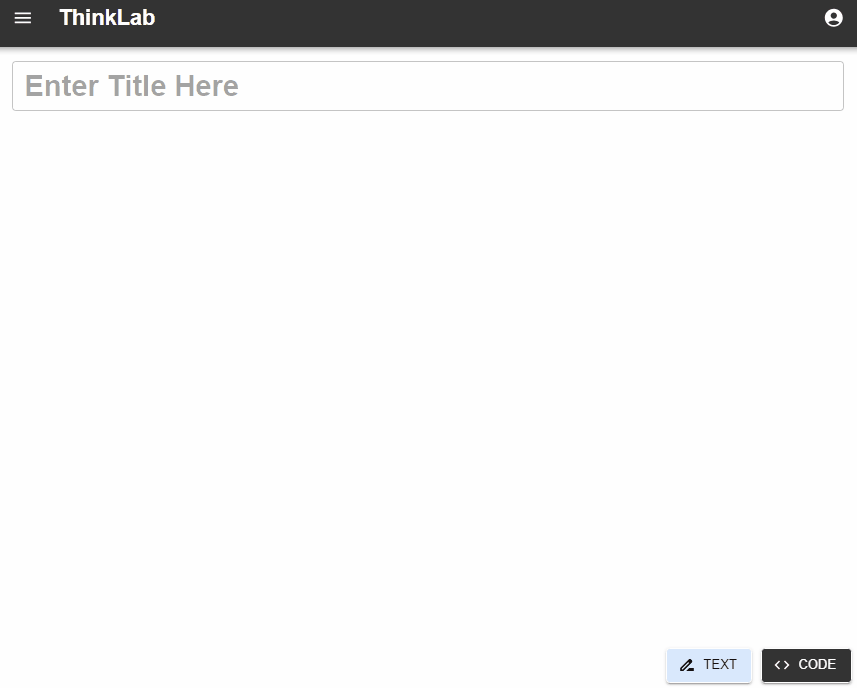

# ThinkLab

## Author: Alvaro E. BL

## Main Technologies

- **Node**
- **Typescript**
- **Express**
- **Graphql**
- **MongoDB**

## Summary

ThinkLab is an API designed to enable remote code execution and manage text and code documents across a variety of devices, including Android, iOS, Windows, and web platforms. This application allows users to seamlessly write, edit, save and share their projects, ensuring consistent accessibility and productivity, so the users can write and execute their code anywhere from any device without any set up required on their part.

## Key Features

- **Remote Code Execution:** Execute code snippets directly from any connected device.
- **Document Management:** Provides capabilities to save, edit, and manage text and code files efficiently.
- **Cross-Platform Support:** Fully accessible from any device with an internet connection.
- **Secure Authentication:** Incorporates JSON Web Tokens (JWT) to manage user sessions securely, ensuring that each request is authenticated and authorized.

## Security Features

- **JWT Authentication:** Utilizes JSON Web Tokens for secure and scalable user authentication.
- **Rate Limiting:** Implements request rate limiting to prevent abuse and to mitigate denial-of-service attacks.
- **SSL/TLS:** Supports SSL/TLS to encrypt data transmitted between clients and the server, protecting data integrity and privacy.
- **CORS Configuration:** Manages Cross-Origin Resource Sharing (CORS) settings to control resource access from other domains, enhancing security against cross-site attacks.
- **Helmet:** Adds an extra layer of security by setting various HTTP headers to protect the app from vulnerabilities.

## Architecture

The architecture of ThinkLab is meticulously crafted to promote ease of maintenance, scalability, and extensibility. The design ensures that the system remains modular, flexible, and easy to understand, making it ideal for both current development and future growth. Below are the key architectural strategies implemented:

- **Modular Design:** Each part of the system is compartmentalized into distinct modules, such as middleware, models, and utilities, with each module having a single, focused responsibility. This separation enhances clarity, simplifies updates, and makes testing more straightforward.

- **Centralized Configuration:** All environment variables are managed centrally through named exports from a single configuration module. This approach allows for easy changes in one place without impacting other parts of the system, ensuring configuration management is simple and reducing the risk of errors.

- **Organized Data Models:** All data models are grouped in a single directory, ensuring they can be easily managed and are interchangeable without affecting the overall system behavior. This organization provides a clear overview of the application's data structures and their relationships.

- **Functionality Segregation:** Each functionality is isolated within its own folder, ensuring that different parts of the application only depend on what they need. This promotes loose coupling, making the system more modular and easier to extend or modify.

- **Scalable Sandbox Environments:** Different sandbox environments for code execution are organized into separate folders, supporting scalability and potential distribution across multiple servers. This structure simplifies the integration of additional programming languages and keeps the system adaptable to future requirements.

- **Streamlined Routing:** All routes are consolidated in a single directory, enhancing the clarity of the API’s structure and making it easier to navigate and modify. This organization supports flexible routing logic, allowing the system to evolve without being tightly coupled to specific frameworks or technologies.

These architectural decisions ensure that ThinkLab is robust, testable, and adaptable, making it well-suited for both rapid development and long-term scalability. The thoughtful separation of concerns and modular design make the codebase easier to understand and extend, which is essential for any ongoing or collaborative development efforts.

## Technology Stack

- **Node.js**: The runtime environment for running JavaScript on the server-side.
- **TypeScript**: Enhances JavaScript by adding static types, leading to more reliable and maintainable code.
- **Express**: A web application framework for Node.js, designed for building web applications and APIs.
- **GraphQL**: A powerful data query language for APIs, allowing clients to request exactly the data they need.
- **MongoDB (Mongoose)**: NoSQL database used for storing user data and code snippets, providing high performance and scalability.
- **bcrypt**: Provides password hashing functionality, enhancing security.
- **body-parser**: Parses incoming request bodies in a middleware before your handlers.
- **cors**: Enables CORS with various options.
- **dotenv**: Loads environment variables.
- **express-rate-limit**: Used to limit repeated requests to public APIs and/or endpoints such as password reset.
- **express-validator**: Middleware that wraps validator.js, a library that provides validator and sanitizer functions.
- **graphql-http**: Middleware for setting up a GraphQL endpoint.
- **helmet**: Helps secure your apps by setting various HTTP headers.
- **jsonwebtoken**: Used to issue JWT for secure authentication.
- **mongoose**: MongoDB object modeling tool designed to work in an asynchronous environment.
- **morgan**: HTTP request logger middleware for node.js.
- **uuid**: For the creation of RFC4122 UUIDs.
- **validator**: A library of string validators and sanitizers.
- **vm2**: Provides sandbox capabilities for running untrusted code.

## Development Features

- **Live Reloading**: Automatically restart the server after changes, reducing downtime during development.
- **Automatic TypeScript Compilation**: Configured to compile TypeScript files on each save, streamlining development by eliminating the need to manually restart the server or recompile the code.
- **Streamlined Error Handling**: Custom middleware for catching and formatting errors, enhancing API reliability and maintainability.
